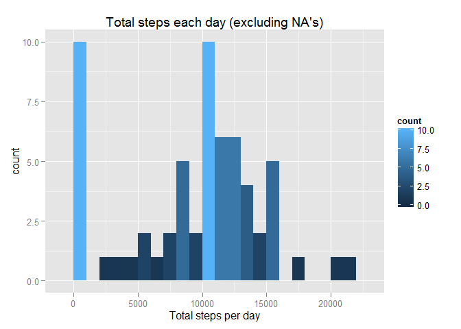
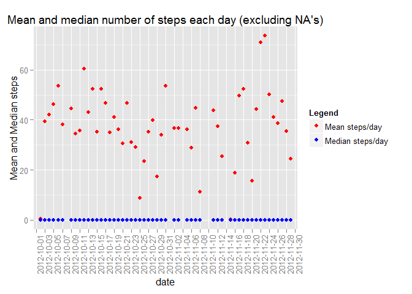
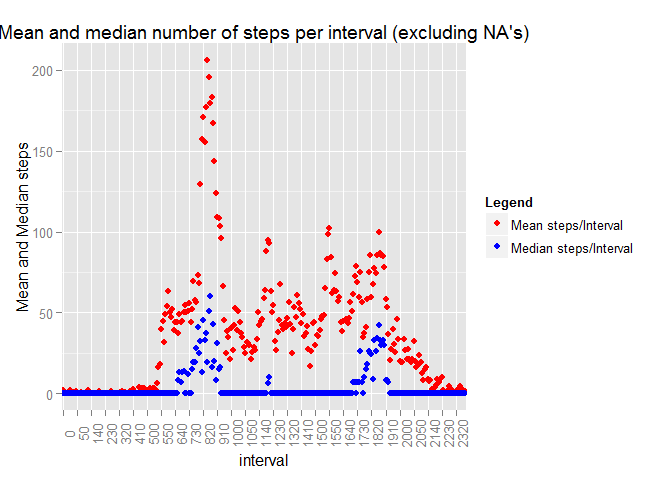
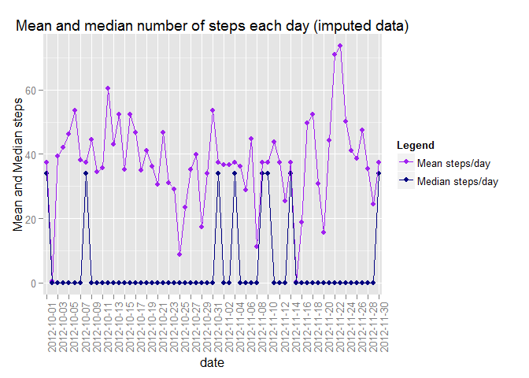

# Reproducible Research: Peer Assessment 1


## Loading and preprocessing the data
* import data.table
* import dplyr
* import ggplots
* read in the data
* Create an interval conversion function
* Create a new date time object including interval as hour and minute
* Create a total steps per day table
* Create a mean steps per day table
* Create a mean steps per interval table

```r
  library(data.table)
  library(dplyr, quietly=T, warn.conflicts=F)
  library(ggplot2, quietly=T, warn.conflicts=F)
  
  data <- read.table(unz("activity.zip", "activity.csv"), sep=',', header=T)
  convInterval <- function(x){if(x<10){paste0('000',x)} else if(x<100){paste0('00',x)} else if(x<1000){paste0('0',x)} else {x} }
   data$dateTime <- as.character(strptime(paste(data$date, lapply(data$interval, convInterval),sep=' '), format="%Y-%m-%d %H%M"))

  # Create the total steps per day table
  grp <- group_by(data,date)
  totalStepsDay <- summarize(grp, TSD=sum(steps, na.rm=TRUE))
  
  # Create the mean/median steps per day table
  meanStepsDay <- summarize(grp, MSD=mean(steps, na.rm=TRUE), MEDSD=median(steps,na.rm=TRUE))
  
  # Create the mean steps per interval table
  grp <- group_by(data,interval)
  
  meanStepsInterval <- as.data.table(summarize(grp, MSI=mean(steps, na.rm=TRUE), MEDSI=median(steps,na.rm=TRUE)))
```
<br><br><br>

## What is mean total number of steps taken per day?
* The following is a historgram of the total number of steps each day (excluding NA's)

```r
  h1 <- ggplot(totalStepsDay, aes(x=TSD)) + geom_histogram(aes(fill=..count..), binwidth=1000) + xlab('Total steps per day')
  print(h1)
```

 
<br><br><br>

* The following is a scatter plot showing the mean and median number of steps each day (excluding NA's)

```r
  cols <- c("Mean"="red","Median"="blue")
  msd <- ggplot(meanStepsDay, aes(x=date, y=MSD, colour="Mean"), na.rm=TRUE, group=1) + geom_point(na.rm=TRUE) + geom_point(data=meanStepsDay, aes(y=MEDSD, colour="Median"), na.rm=TRUE, group=1) + theme(axis.text.x=element_text(angle=90)) + scale_x_discrete(breaks=meanStepsDay$date[seq(1,nrow(meanStepsDay),2)]) + scale_colour_manual(name="Legend",values=cols, labels=c("Mean steps/day", "Median steps/day")) + ylab('Mean and Median steps')
  print(msd)
```

 
<br><br><br>

## What is the average daily activity pattern?
* The following is a scatter plot showing: average and median number of steps taken (across all days) versus the 5-minute intervals (excluding NA's)

```r
  msi <- ggplot(meanStepsInterval, aes(x=as.factor(interval), y=MSI, colour="Mean"), na.rm=TRUE, group=1) + 
  geom_point(na.rm=TRUE) + 
  geom_point(data=meanStepsInterval, aes(y=MEDSI, colour="Median"), na.rm=TRUE, group=1) + 
  theme(axis.text.x=element_text(angle=90)) + 
  scale_x_discrete(breaks=meanStepsInterval$interval[seq(1,nrow(meanStepsInterval),10)]) + 
  scale_colour_manual(name="Legend",values=cols, labels=c("Mean steps/Interval", "Median steps/Interval")) + 
  ylab('Mean and Median steps')
  print(msi)
```

 
<br><br><br>

* The following is a scatter plot showing: average and median number of steps taken (across all days) versus the 5-minute intervals, where mean steps is greater than the 95th percentile (excluding NA's)
* Interval 835 had the highest average steps.

```r
  pVal <- quantile( meanStepsInterval$MSI, probs=c(0.95))
  meanStepsIntervalGt95p <- subset(meanStepsInterval, MSI > pVal)
  meanStepsIntervalGt95p$interval <- as.factor(meanStepsIntervalGt95p$interval)
  ggplot(meanStepsIntervalGt95p, aes(x=interval, y=MSI, colour="Mean", group=1), na.rm=TRUE) + geom_point() + geom_point(data=meanStepsIntervalGt95p, aes(y=MEDSI, colour="Median"), na.rm=TRUE, group=1) + theme(axis.text.x=element_text(angle=90)) + scale_colour_manual(name="Legend",values=cols, labels=c("Mean steps/Interval", "Median steps/Interval")) + ylab('Mean and Median steps')
```

 
<br><br><br>

## Imputing missing values
* The number of NA (missing) values in the dataset

```r
nrow(data[is.na(data$steps),])
```

```
## [1] 2304
```
<br><br><br>

* Create getMeanInterval function for imputing missing data

```r
  # Function that will return the the mean steps for an interval (for all days) when steps is NA 
  # otherwise it will return the current steps
  getMeanInterval <- function(x,s){ if(is.na(x)){ meanStepsInterval[interval==s,MSI] } else{ x } }
```
<br><br><br>

* Create copy of the main data table and update steps with the mean step for an interval (for all days) when steps is NA

```r
  # Copy the table
  data2 <- data.table(data)  
  
  # create a modified steps column populated by the getMeanInterval function
  data2$steps <- mapply(data$steps, FUN=getMeanInterval, s=data$interval)
  
  # Create the mean steps per day (all intervals) table
  grp <- group_by(data2,date)
  totalStepsDay2 <- summarize(grp, TSD=sum(steps))

  # Create the mean steps per day (all intervals) table
  meanStepsDay2 <- summarize(grp, MSD=mean(steps), MEDSD=median(steps))
```
<br><br><br>

* The following is a historgram of the total number of steps per day, using the updated data table

```r
  h2 <- ggplot(totalStepsDay2, aes(x=TSD)) + geom_histogram(aes(fill=..count..), binwidth=1000) + xlab('Total steps per day')
  print(h2)
```

 
<br><br><br>

* The following is a scatter plot showing the mean and median number of steps per day, using the updated data table

```r
  msd2 <- ggplot(meanStepsDay2, aes(x=date, y=MSD)) + 
  geom_point(aes(colour="ModMean", group=1)) + 
  geom_point(data=meanStepsDay2, aes(x=date, y=MEDSD, colour="ModMedian", group=3)) + 
  geom_line(aes(x=date, y=MSD, colour="ModMean", group=1)) + 
  geom_line(data=meanStepsDay2, aes(x=date, y=MEDSD, colour="ModMedian", group=3)) + 
  theme(axis.text.x=element_text(angle=90)) + 
  scale_x_discrete(breaks=meanStepsDay2$date[seq(1,nrow(meanStepsDay2),2)]) + 
  scale_color_manual(name="Legend",values=c("ModMean"="purple", "Mean"="red", "ModMedian"="navyblue", "Median"="blue"), labels=c( "Mean steps/day", "Median steps/day", "Modified Mean steps/day", "Modified Median steps/day")) + 
  ylab('Mean and Median steps')

  print(msd2)
```

 
<br><br><br>

* The following is a scatter plot showing the mean number of steps per day from both datasets, purple dots indicate mean values that were not present in the original dataset

```r
sc1 <- ggplot(meanStepsDay2, aes(x=date, y=MSD)) + 
  geom_point(aes(colour="ModMean", group=1)) + 
  geom_line(aes(x=date, y=MSD, colour="ModMean", group=1)) + 
  geom_point(data=meanStepsDay, aes(x=date, y=MSD, colour="Mean", group=3)) + 
  geom_line(data=meanStepsDay, aes(x=date, y=MSD, colour="Mean", group=3)) + 
  theme(axis.text.x=element_text(angle=90)) + 
  scale_x_discrete(breaks=meanStepsDay2$date[seq(1,nrow(meanStepsDay2),2)]) + 
  scale_color_manual(name="Legend",values=c("ModMean"="purple", "Mean"="red"), labels=c( "Mean steps/day", "Modified Mean steps/day")) + 
  ylab('Mean steps')
  
  suppressWarnings(print(sc1))
```

 
<br><br><br>

* The following is a scatter plot showing the median number of steps per day from both datasets, purple dots indicate median values that were not present in the original dataset

```r
sc2 <- ggplot(meanStepsDay2, aes(x=date, y=MEDSD)) + 
  geom_point(aes(colour="ModMean", group=1)) + 
  geom_line(aes(x=date, y=MEDSD, colour="ModMean", group=1)) + 
  geom_point(data=meanStepsDay, aes(x=date, y=MEDSD, colour="Mean", group=3)) + 
  geom_line(data=meanStepsDay, aes(x=date, y=MEDSD, colour="Mean", group=3)) + 
  theme(axis.text.x=element_text(angle=90)) + 
  scale_x_discrete(breaks=meanStepsDay2$date[seq(1,nrow(meanStepsDay2),2)]) + 
  scale_color_manual(name="Legend",values=c("ModMean"="purple", "Mean"="red"), labels=c( "Median steps/day", "Modified Median steps/day")) + ylab('Median steps')
  
  suppressWarnings(print(sc2))
```

 
<br><br><br>


## Are there differences in activity patterns between weekdays and weekends?
* Panel plot showing the average number of steps taken per interval, faceted by dayType (Weekend, weekday)

```r
  getWeekendWeekday <- function(x){ type <- weekdays(as.Date(x)); if(type=="Sunday" || type=="Saturday"){ "weekend" } else{ "weekday" } }
 
  data2$dayType <- as.factor(mapply(data2$date, FUN=getWeekendWeekday))
 
  grp <- group_by(data2,dayType,interval)
  meanStepsDayType <- summarize(grp, MSD=mean(steps), MEDSD=median(steps))
  
  meanStepsDayType$interval <- as.factor(meanStepsDayType$interval)
  
  ggplot(meanStepsDayType, aes(x=interval, y=MSD)) + 
  geom_point(aes(colour="ModMean", group=1)) + 
  geom_line(aes(x=interval, y=MSD, colour="ModMean", group=1)) + 
  theme(axis.text.x=element_text(angle=90)) + 
  scale_x_discrete(breaks=meanStepsDayType$interval[seq(1,nrow(meanStepsDayType)/2,10)]) + 
  scale_color_manual(name="Legend",values=c("ModMean"="purple", "Mean"="red", "ModMedian"="navyblue", "Median"="blue"), labels=c( "Mean steps/day", "Median steps/day", "Modified Mean steps/day", "Modified Median steps/day")) + 
  ylab('Mean and Median steps') + facet_wrap(~dayType, ncol=1)
```

 
